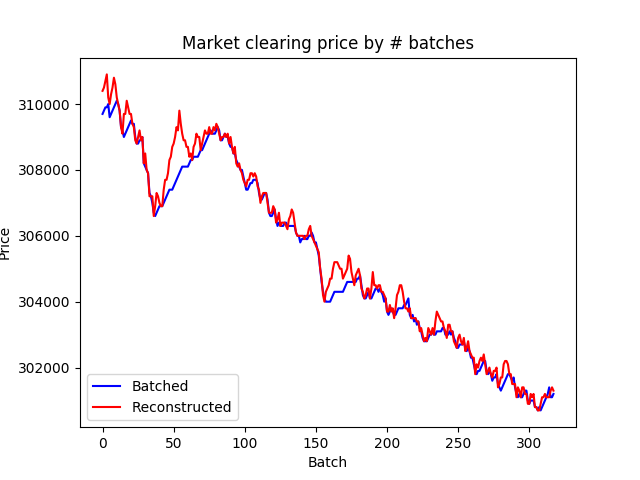
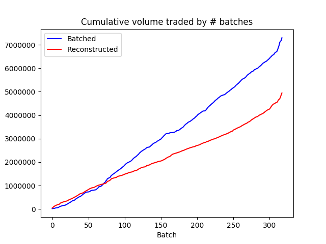

# A Simulator for Evaluating Welfare Implications of Frequent Batched Auctions in High Frequency Trading (HFT)

An analytical tool for evaluating welfare gains and losses from policy responses to high frequency trading (HFT). In particular, this simulator implements two batching paradigms on historical order book data (a sample file of which is provided in this repository). Experimenters can either batch by adding message blocks of a fixed size to the order book at every evaluation step, or by adding messages within a fixed time interval.  


The simulator tracks the following five metrics for a given batching strategy: 
  * Imputed equilibrium price over time compared to the observed prices at which the asset was traded in the historical data.
  * Imputed trading volume and number of trades over time compared to the observed volume and number of trades in the historical data. 
  * Size of the open order book over time (where a large size indicates it is difficult to fill some orders, and a small size indicates most orders are being filled). 
  * Time interval width of each batch added to the order book. (In time-based batching, this may be less than the window interval width of the batch if the asset is sparsely traded.) 
  
Sample results computed from simulation are below. These data were produced by batching trades in constant blocks of size 2000 orders. Notice that for batches of this large a size, there are significant price perturbations compared to the reconstructed historical price trend, and the volume welfare effects of batching are substantially reduced. 

 

You can clone a copy of this repository with:

```
git clone https://github.com/aakash-pattabi/cs269i-batching-simulator
```

To reproduce the results shown above, `cd` into the directory and run: 

```
python batchingSimulator.py ./MSFT_2012-06-21_message_10.csv 2000 --const_batch_size
```

The general form for the command is: 

```
python batchingSimulator.py ./MSFT_2012-06-21_message_10.csv STRIDE [--const_batch_size OR --time_interval]
```

Using the flag `--time_interval` as opposed to `--const_batch_size` will batch in a set time increment equal to `STRIDE` seconds.
